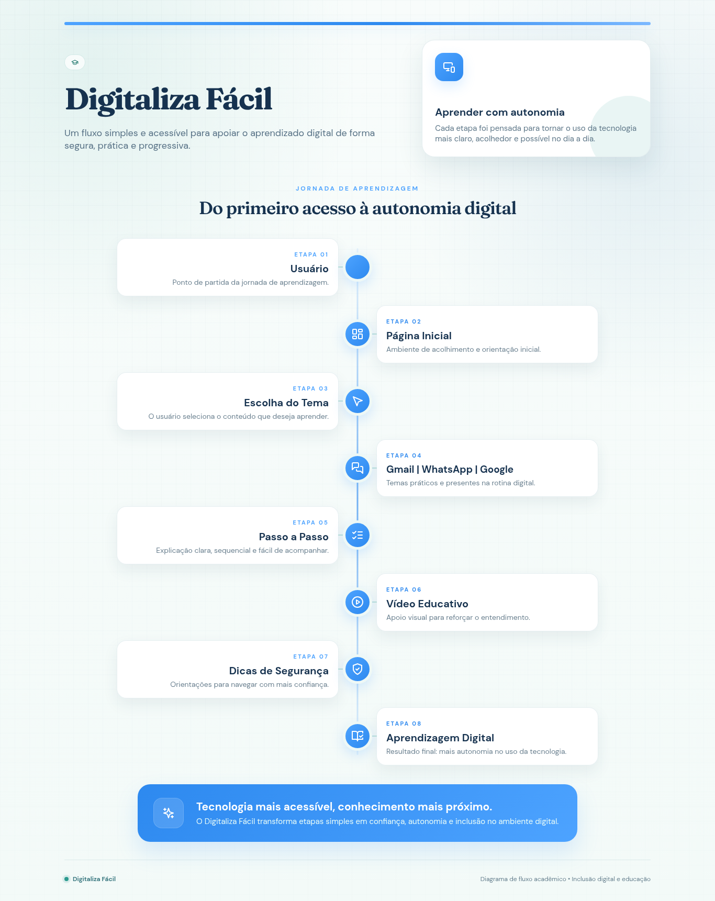
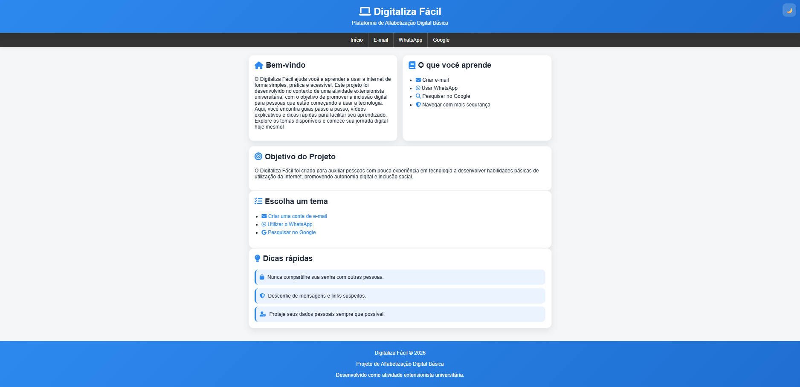
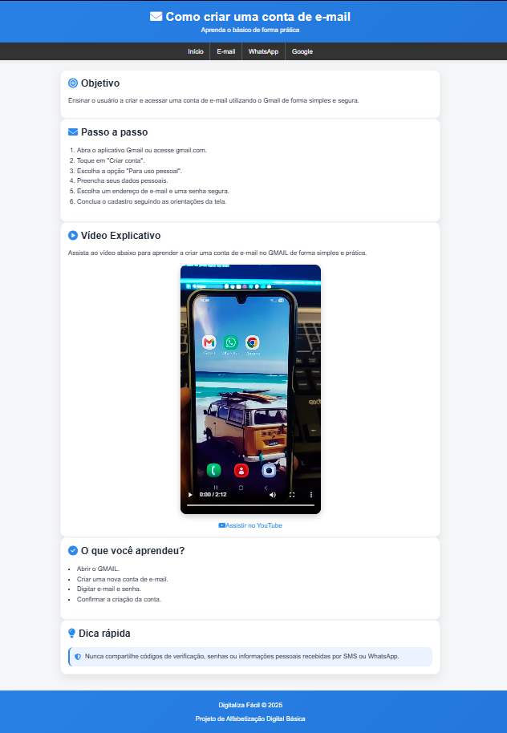
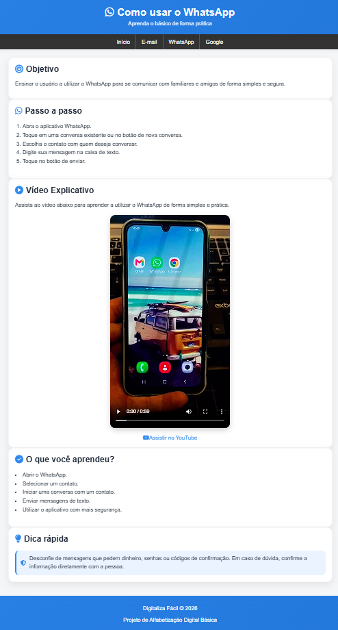
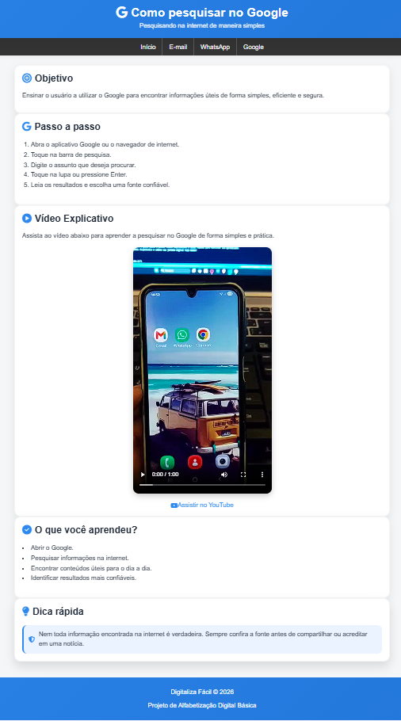

# 💻 Digitaliza Fácil

## Sobre o Projeto

O Digitaliza Fácil é uma plataforma de alfabetização digital básica desenvolvida como atividade extensionista do curso de Análise e Desenvolvimento de Sistemas.

O projeto tem como objetivo auxiliar pessoas com pouca experiência em tecnologia a aprenderem conceitos básicos de utilização da internet por meio de conteúdos simples, acessíveis e práticos.

A plataforma disponibiliza orientações passo a passo, vídeos explicativos e dicas de segurança digital para facilitar o aprendizado de usuários iniciantes.

---

## Objetivos

* Promover a inclusão digital.
* Facilitar o acesso ao conhecimento tecnológico.
* Ensinar o uso de ferramentas digitais básicas.
* Incentivar a navegação segura na internet.
* Desenvolver a autonomia digital dos usuários.

---

## Funcionalidades

### 📧 Criação de Conta de E-mail

* Passo a passo para criação de uma conta Gmail.
* Vídeo explicativo.
* Dicas de segurança.

### 💬 Utilização do WhatsApp

* Como iniciar conversas.
* Como enviar mensagens.
* Orientações de uso seguro.

### 🔎 Pesquisa no Google

* Como realizar pesquisas.
* Como encontrar informações úteis.
* Boas práticas de navegação.

---

## Tecnologias Utilizadas

* HTML5
* CSS3
* JavaScript
* Font Awesome
* GitHub Pages
* YouTube Shorts

---

## Estrutura do Projeto

## Estrutura do Projeto

```text
Digitaliza Facil/
│
├── index.html
├── email.html
├── whatsapp.html
├── google.html
├── style.css
├── script.js
│
├── videos/
│   ├── email.mp4
│   ├── whatsapp.mp4
│   └── google.mp4
│
└── docs/
    ├── diagrama-digitaliza-facil.png
    ├── tela-inicial.png
    ├── tela-email.png
    ├── tela-whatsapp.png
    └── tela-google.png
```

---

## Diagrama de Funcionamento

O fluxo de utilização da plataforma Digitaliza Fácil é apresentado no diagrama abaixo:


<p align="center">
  
</p>


---

## Capturas de Tela

###


<h3 align="center">Página Inicial</h3>

<p align="center">
  
</p>

### 

<h3 align="center">Tutorial Gmail</h3>

<p align="center">
  
</p>

### 

<h3 align="center">Tutorial WhatsApp</h3>

<p align="center">
  
</p>

### 

<h3 align="center">Pesquisa no Google</h3>

<p align="center">
  
</p>

---

## Público-Alvo

O projeto foi desenvolvido para pessoas que possuem pouca familiaridade com recursos digitais, especialmente:

* Idosos;
* Iniciantes no uso da internet;
* Pessoas em processo de inclusão digital;
* Usuários que desejam aprender ferramentas básicas de comunicação e pesquisa.

---

## Implementação

O projeto foi implementado e testado na cidade de Sete Lagoas/MG, com foco na promoção da inclusão digital e no ensino de habilidades básicas de utilização da internet.

---


## Acesso ao Projeto

🔗 Site Online: https://ileao19.github.io/digitaliza-facil/

---

## Resultados Esperados

* Maior autonomia digital dos usuários;
* Aprendizado de ferramentas essenciais para comunicação e pesquisa;
* Incentivo ao uso seguro da internet;
* Ampliação do acesso à informação por meio da tecnologia.

---

## Demonstração

O projeto possui vídeos demonstrativos de utilização da plataforma em computador e dispositivo móvel, apresentando o funcionamento das funcionalidades e a aplicação prática da solução desenvolvida.

🎥 Vídeo demonstrativo:
[Assistir vídeo](COLE_AQUI_O_LINK_DO_DRIVE)

---

## Autor

Igor Leão Pedras de Magalhães

Curso: Análise e Desenvolvimento de Sistemas

Projeto desenvolvido como atividade extensionista universitária.
